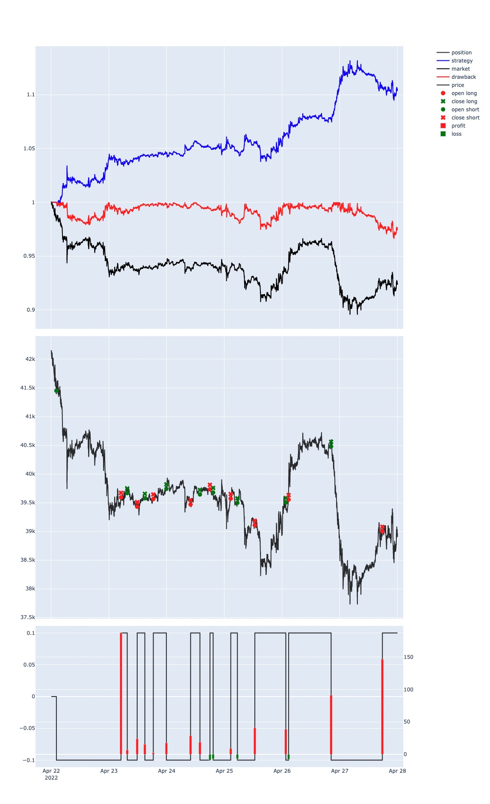

#### Depth/Kline回测框架系统
本回测框架系统基于事件驱动,实现交易所合约数据的实时获取，可分别基于深度订单簿或K线数据进行订单撮合回测，完成回测盈利相关结果统计。
&nbsp;
##### 安装方法
###### Git
```pip3 install git+https://github.com/cRexxar/mexcBT.git  ```
&nbsp;
<!-- ###### pip -->
##### 使用基本方法及返回数值
###### 回测策略基础框架
  ```python
  from mexcBT.backTest import sdk
  
  class Strategy(sdk):
        def prepare(self):
            '''
            策略开始前的准备，config里的所有key都会赋值到self
            '''        
            pass

        def perCycle(self):
            '''
            按照config里面的cycle字段进行depth/kline的回放
            主策略逻辑放在此处
            '''

        def review(self):
            '''
            策略结束后用户自定义的复盘数据查看
            ''''

  def main():
        config = {
          'h5Path'          # 用户h5文件夹路径
          'strategy'        # 策略名称
          'startDate'       # 回测开始时间
          'endDate'         # 回测结束时间
          'symbol'          # 回测交易标的
          'exchange'        # 回测交易所指定
          'cycle'           # 回测模式设置 订单簿回测tick K线回测 1min
          'klineInterval'   # 提前声明需要用到的kline周期 ['3m', '1h', '1d', '1w', '2d']. default: []
          'initCapital'     # 回测初始资金 5000
          'capitalCoin'     # 回测本位币单位 'usdt
          'fee'             #交易手续费  0.0005
          'positionMode'    # 持仓模式 cross 双向持仓
          'volumeThreshold' # 分钟线成交量撮合阈值. default: 0.2
        }
        task = Strategy(config)
        task.run()
  
  if __name__ == '__main__':
        main()
  ```
&nbsp;
###### 回测结果统计
  回测结束后自动产生回测结果及相关图像
  ```
  策略总结
  期末净值:  年化收益:  最大回撤:
  交易次数 总: 多: 空:
  开平回合 总: 多: 空:
  胜率 总: 多: 空:
  盈亏比 总: 多: 空:
  平均持仓时间(mins) 总: 多: 空:
  ```
  
&nbsp;
###### 基本变量参数
  * 订单/查询回报状态码
    - **100000**: **调用成功, 正常返回数据**
    - **100001**: **调用失败, 未定义错误**
    - **100002**: **网络错误** (回测框架内不实现)
    - **100003**: **下单不足最小量**
    - **100004**: **下单超过最大值**
    - **100005**: **参数不合法**
    - **100006**: **下单价格超出限制**
    - **100007**: **请求过于频繁** (回测框架内不实现)
    - **100008**: **不允许自成交** (回测框架内不实现)
    - **100009**: **api key 不存在或失效** (回测框架内不实现)
    - **100010**: **余额不足, 下单失败**
    - **100011**: **订单不存在**
    - **100012**: **网络超时** (回测框架内不实现)
  * 订单类型
    - **LIMIT**: **限价单**
    - **MARKET**: **市价单**
  * 订单方向
    - **LONG**: **多单**
    - **SHORT**: **空单**
    - **CLOSE_LONG**: **平多**
    - **CLOSE_SHORT**: **平空**
  * 订单状态
    - **FAILED**: **失败**
    - **CANCELED**: **取消**
    - **OPEN**: **未成交**
    - **PARTIALLY_FILLED**: **部分成交**
    - **FILLED**: **已成交**
###### 行情基本操作
  * 获取当前时间
    ```python
    def getTime(self)   # 获取字符串时间 
    def getTs(self)     # 获取时间戳
    ```
  * Depth 模式下
    * 获取当前订单簿
      * 获取方法
      ```python
      def fetch_order_book(self, symbol, size=10):
        '''
        Args:
          symbol: 标的代码
          size: 订单簿档位
        '''
      ```
      * 返回结果
      ```python
        '''
        return ->np.array shape (2, 10, 2)
        第一纬度 0: bid list, 1: ask list
        第二维度 0-9档
        第三维度 价量
        '''
      ```
    * 获取过去N个成交tick
      * 获取方法
      ```python
      def fetch_trades(self, symbol, size=100):
        '''
        Args:
          symbol: 标的代码
          size: 过去成交tick数量
        '''
      ```
      * 返回结果
      ```python
        '''
        return -list
        元素: [时间, 价格, 数量, 买卖方向]
        '''
      ```
  * K线模式下
    * 获取指定时间周期过去N跟K线
      * 获取方法
      ```python
      def fetch_ohlcv(self, symbol, interval='1m', size=1):
        '''
        Args:
          symbol: 标的代码
          interval: K线周期
          size: K线数量
        '''
      ```
      * 返回结果
      ```python
        '''
        return -list[[]]
        单位元素: [时间, 最高价, 开盘价, 最低价, 收盘价, 交易量, 交易额, 买入成交量, 买入成交额, 当前K线是否完成]
        '''
      ```
###### 订单类基本操作 - 在```perCycle```中调用```self.xxx```进行操作
  * 下单
    * LONG/SHORT
      * 下单方法,指定type为**LONG/SHORT**
        ```python
        def create_order(symbol, px, qty, side, type='LONG/SHORT', lerverage):
          '''
          Args:
            symbol: 标的代码
            px: 订单价格
            qty: 订单数量
            side: 订单方向 Long Short
            action: 开仓:open 平仓:close
            type: 限价单 LIMIT 市价单 MARKET
            leverage: 杠杆率
          '''
        ```
      * 返回字段 - 订单方向与下单方向**相同**, 订单动作为**open**
        ```python
        {
          'code': 100000,
          'msg': '调用成功, 正常返回数据',
          'data': {
            'symbol'        # 标的名称
            'order_id'      # 订单id
            'side'          # 订单方向
            'status'        # 订单状态为OPEN
            'px'            # 价格
            'f_px'          # 平均成交价格
            'qty'           # 数量
            'f_qty'         # 成交数量
            'u_qty'         # 未成交数量
            'action'        # 订单动作
            'fee'           # 手续费
            'type'          # 订单类型
            'c_time'        # 创建订单时间戳
            'u_time'        # 更新订单时间戳
            'leverage'      # 订单杠杆
          }
        }
        ```
    * CLOSE_LONG/SHORT
      * 下单方法, 指定type为**CLOSE_LONG/CLOSE_SHORT**
        ```python
        def create_order(symbol, px, qty, side, type='CLOSE_LONG/CLOSE_SHORT', lerverage):
          '''
          Args:
            symbol: 标的代码
            px: 订单价格
            qty: 订单数量
            side: 订单方向 Long Short
            action: 开仓:open 平仓:close
            type: 限价单 LIMIT 市价单 MARKET
            leverage: 杠杆率
          '''
        ```
      * 返回字段 - 订单方向与下单方向**相反**, 订单动作为**close**
        ```python
        {
          'code': 100000,
          'msg': '调用成功, 正常返回数据',
          'data': {
            'symbol'        # 标的名称
            'order_id'      # 订单id
            'side'          # 订单方向
            'status'        # 订单状态为OPEN
            'px'            # 价格
            'f_px'          # 平均成交价格
            'qty'           # 数量
            'f_qty'         # 成交数量
            'u_qty'         # 未成交数量
            'action'        # 订单动作
            'fee'           # 手续费
            'type'          # 订单类型
            'c_time'        # 创建订单时间戳
            'u_time'        # 更新订单时间戳
            'leverage'      # 订单杠杆
          }
        }
        ```
  * 撤单
    * 撤指定订单
      * 撤单方法
        ```python
        def cancel_order(self, order_id):
          '''
          Args:
            order_id: 订单id
        ```
      * 返回字段
        ```python
        {
          'code': 100000,
          'msg': '调用成功, 正常返回数据',
          'data': {
            'order_id': order_id
          }
        }
        ```
      
    * 撤所有未成交订单
      * 撤单方法
        ```python
        def cancel_all_order(self):
        ```
      * 返回字段
        ```python
        {
          'code': 100000,
          'msg': '调用成功, 正常返回数据',
          'data': {
            'order_ids': []
          }
        }
        ```
  * 订单查询
    * 指定订单查询
      * 查询方法
        ```python
        def fetch_order(self, order_id):
          '''
          Args:
            order_id: 订单id
          '''
        ```
      * 返回字段
        ```python
        {
          'code': 100000,
          'msg': '调用成功, 正常返回数据',
          'data': {
            'symbol'        # 标的名称
            'order_id'      # 订单id
            'side'          # 订单方向
            'status'        # 订单状态为OPEN
            'px'            # 价格
            'f_px'          # 平均成交价格
            'qty'           # 数量
            'f_qty'         # 成交数量
            'u_qty'         # 未成交数量
            'action'        # 订单动作
            'fee'           # 手续费
            'type'          # 订单类型
            'c_time'        # 创建订单时间戳
            'u_time'        # 更新订单时间戳
            'leverage'      # 订单杠杆
          }
        }
        ```
    * 所有未成交订单查询
      * 查询方法
        ```python
        def fetch_open_orders(self):
        ```
      * 返回字段
        ```python
        {
          'code': 100000,
          'msg': '调用成功, 正常返回数据',
          'data': [
            {
            'symbol'        # 标的名称
            'order_id'      # 订单id
            'side'          # 订单方向
            'status'        # 订单状态为OPEN
            'px'            # 价格
            'f_px'          # 平均成交价格
            'qty'           # 数量
            'f_qty'         # 成交数量
            'u_qty'         # 未成交数量
            'action'        # 订单动作
            'fee'           # 手续费
            'type'          # 订单类型
            'c_time'        # 创建订单时间戳
            'u_time'        # 更新订单时间戳
            'leverage'      # 订单杠杆
            },
            {} 
          ]
        }
        ```
###### 仓位查询 - 当前仓位信息
  * 查询方法
    ```python
    def fetch_user_position()
    ```
  * 返回字段
    ```python
    {
      'code': 100000,
      'msg': '调用成功, 正常返回数据',
      'data': [{
        'symbol'            # 标的名称
        'position'          # 持仓量
        'margin'            # 保证金
        'avg_cost'          # 平均持仓成本
        'side'              # 持仓方向
        'unrealised_pnl'    # 浮盈
      }]
    }
    ```  
###### 账户查询 - 当前账户信息
  * 查询方法
    ```python
    def fetch_balance(self):
    ```
  * 返回字段
    ```python
    {
      'code': 100000,
      'msg': '调用成功, 正常返回数据',
      'data': [{
        'total'            # 总资金
        'frozen'           # 冻结资金
        'free'             # 可用资金
        'total_margin'     # 总保证金量
        'unrealised_pnl'   # 浮动盈亏
        'realized_pnl'     # 已实现盈亏
        'fee'              # 手续费
      }]  
    }
    ````
##### 数据
##### 深度数据撮合机制
###### 市价单
  多单(空单)下单后，与现有Ask(Bid) Depth进行匹配，若下单量超过总深度量，则返回错误，否则匹配成功,更新订单状态。
###### 限价单
  多单(空单)下单后将订单保留至多头(空头)未成交订单中，每次获取到新的深度数据后，对当前多头(空头)订单按价格进行由高到低(由低到高)排序，并依次与Ask(Bid) Depth进行匹配，更新该订单状态,同时更新当前Ask(Bid) Depth。剩余未成交量保留。
##### K线数据撮合机制
根据配置文件中设定的匹配阈值，即当前K线成交量不能高于总成交量的相对比例。
###### 市价单
  以下一根一分钟K线的开盘价计价进行匹配,若交易量超过阈值,返回错误。
###### 限价单
  多单(空头)限价价格高于(低于)下一根一分钟K线开盘价,以开盘价计价匹配。价格低于(高于)开盘价，高于最低价(低于最高价)，以挂单价格计价匹配。单一分钟K线匹配量为设置阈值。

&nbsp;
#### Depth 模版
```python
from mexcBT.backTest import sdk
from collections import deque
import pandas as pd

class Strategy(sdk):


    def prepare(self):
        """策略开始前的准备  config里的所有key都会赋值到self
        """        
        self.qty = 0.1  # 满仓下单量
        self.length = 7200 # 队列长度
        self.net = deque(maxlen=self.length)  # 定长队列
        self.longFlag = False  # 是否持多仓
        self.shortFlag = False  # 是否持空仓
        self.totalNet = None  # 是否记录了总net
        self.totalNetList = []  # 策略结束后复盘用
        self.percent = 0.53  # 多空数量比
        self.value = round(self.length*self.percent-self.length*(1-self.percent), 0)  # 多空flag差值
        print(f"value: {self.value}")

    def perCycle(self):
        """按深度回放
        策略主逻辑
        """      
        depth = self.fetch_order_book(self.symbol)  # 拿取当前深度
        bidVol = sum(depth[0, :5, 1])  # 算5档买量和
        askVol = sum(depth[1, :5, 1])  # 算5档卖量和
        flag = 1 if bidVol>askVol else -1  # 记压力flag

        ''' 自定义算法模块 '''
        if self.totalNet is not None:
            self.totalNet += (flag-self.net[0])
            self.totalNetList.append(self.totalNet)

        self.net.append(flag)

        if len(self.net)<self.length:
            return
        if len(self.net)==self.length and self.totalNet is None:
            self.totalNet = sum(self.net)
        ''' 自定义算法模块 '''

        if self.totalNet>=self.value and not self.longFlag:
            pos = self.fetch_user_position()['data']  # 获取仓位

            if len(pos)!=0:
                short = {'position': i['position'] for i in pos if i['side']=='SHORT'}.get('position', 0)
            else:
                short = 0
            if short != 0:
                # 若有空仓先平仓
                self.create_order(self.symbol, 0, qty=short, side='CLOSE_SHORT', type='MARKET')  # 下市价单
            self.create_order(self.symbol, 0, qty=self.qty, side='LONG', type='MARKET')  # 下市价单
            
            # 避免重复开仓
            self.longFlag = True
            self.shortFlag = False

        elif self.totalNet<=-self.value and not self.shortFlag:
            pos = self.fetch_user_position()['data']  # 获取仓位
            if len(pos)!=0:
                long = {'position': i['position'] for i in pos if i['side']=='LONG'}.get('position', 0)
            else:
                long = 0
            if long != 0:
                self.create_order(self.symbol, 0, qty=long, side='CLOSE_LONG', type='MARKET')  # 下市价单
            self.create_order(self.symbol, 0, qty=self.qty, side='SHORT', type='MARKET')  # 下市价单
            
            # 避免重复开仓
            self.shortFlag = True
            self.longFlag = False

    def review(self):
        """策略结束后 用户自定义的复盘
        """         
        data = pd.DataFrame(self.totalNetList)
        print(data.describe())  # 查看flag序列总结


def main():
    config = {
        'h5Path': '/Users/admin/python3/ReCrypto/dataBase/h5/binanceUsdtSwap/btc-usdt',  # 用户h5文件夹路径
        'strategy': 'tickDemo',
        'startDate': 20220422,
        'endDate': 20220427,
        'symbol': 'btc/usdt',
        'exchange': 'binanceUsdtSwap',
        'cycle': 'tick', #tick or 1min
        
        'initCapital': 5000,
        'capitalCoin': 'usdt',
        'fee': 0.0005,  
        'positionMode': 'cross',  # 双向持仓
    }
    task = Strategy(config)
    task.run()


if __name__ == '__main__':
    main()
```
&nbsp;
#### Kline 模版
```python
from mexcBT.backTest import sdk

class Strategy(sdk):


    def prepare(self):
        """策略开始前的准备  config里的所有key都会赋值到self
        """        
        self.flag = 0
        self.qty = 0.1
        self.longFlag = False
        self.shortFlag = False
        self.size = 500
        pass

    def perCycle(self):
        """按深度回放
        策略主逻辑
        """      
        kline = self.fetch_ohlcv(self.symbol, '1m', size=self.size)
        if len(kline)<self.size:
            return
        else:
            if not self.longFlag and kline[-1][4] > max(i[1] for i in kline[:-1]):
                print(kline[-1][4], max(i[1] for i in kline[:-1]))
                pos = self.fetch_user_position()['data']  # 获取仓位

                if len(pos)!=0:
                    short = {'position': i['position'] for i in pos if i['side']=='SHORT'}.get('position', 0)
                else:
                    short = 0
                if short != 0:
                    # 若有空仓先平仓
                    res = self.create_order(self.symbol, 0, qty=short, side='CLOSE_SHORT', type='MARKET')  # 下市价单
                self.create_order(self.symbol, 0, qty=self.qty, side='LONG', type='MARKET')  # 下市价单
                self.longFlag = True
                self.shortFlag = False
            
            elif not self.shortFlag and kline[-1][4] < min(i[3] for i in kline[:-1]):
                print(kline[-1][4], max(i[3] for i in kline[:-1]))
                pos = self.fetch_user_position()['data']  # 获取仓位
                if len(pos)!=0:
                    long = {'position': i['position'] for i in pos if i['side']=='LONG'}.get('position', 0)
                else:
                    long = 0
                if long != 0:
                    self.create_order(self.symbol, 0, qty=long, side='CLOSE_LONG', type='MARKET')  # 下市价单
                self.create_order(self.symbol, 0, qty=self.qty, side='SHORT', type='MARKET')  # 下市价单
                
                # 避免重复开仓
                self.shortFlag = True
                self.longFlag = False       


    def review(self):
        """策略结束后 用户自定义的复盘
        """         
        pass


def main():
    config = {
        'h5Path': '/Users/admin/python3/ReCrypto/dataBase/h5/binanceUsdtSwap/btc-usdt',  # 用户h5文件夹路径
        'strategy': 'klineDemo',
        'startDate': 20220422,
        'endDate': 20220428,
        'symbol': 'btc/usdt',
        'exchange': 'binanceUsdtSwap',
        'cycle': '1min', #tick or 1min
        'klineInterval': ['3m', '1h', '1d', '1w', '2d'],  # 提前声明需要用到的kline周期
        
        'initCapital': 5000,
        'capitalCoin': 'usdt',
        'fee': 0.0005,  
        'positionMode': 'cross',  # 双向持仓
        # 'volumeThreshold': 0.5,  分钟线成交量撮合阈值
    }
    task = Strategy(config)
    task.run()


if __name__ == '__main__':
    main()
```